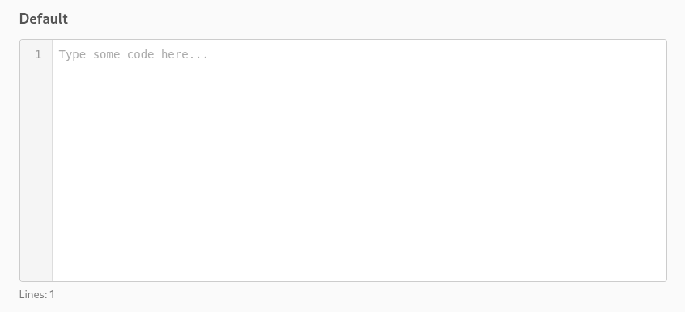

# numbered-textarea

A textarea with line numbers — like VS Code, but as a drop-in component. Available as a **Web Component**, **React**, and **Vue** component.

Each framework has its own subpath import — only import what you use.

<p align="center">
  
</p>

## Install

```bash
npm install numbered-textarea
```

## Web Component

```js
import { register } from "numbered-textarea/web";
register();
```

```html
<numbered-textarea placeholder="Write some code..."></numbered-textarea>
```

### API

#### `register(tagName?: string)`

Registers the custom element. Call once before using the tag. Idempotent.

#### `NumberedTextarea` class

The custom element class, also available for direct use:

```js
import { NumberedTextarea } from "numbered-textarea/web";
customElements.define("my-editor", NumberedTextarea);
```

#### Attributes

| Attribute     | Type      | Description                                               |
| ------------- | --------- | --------------------------------------------------------- |
| `value`       | `string`  | The text content                                          |
| `placeholder` | `string`  | Placeholder text when empty                               |
| `readonly`    | `boolean` | Prevents editing                                          |
| `disabled`    | `boolean` | Disables the textarea                                     |
| `wrap`        | `string`  | Wrapping behavior (`off`, `soft`, `hard`). Default: `off` |

#### Properties

| Property    | Type     | Description                        |
| ----------- | -------- | ---------------------------------- |
| `value`     | `string` | Get/set the text content           |
| `lineCount` | `number` | Read-only count of lines (1-based) |

#### Events

| Event      | Detail                                 | Description                 |
| ---------- | -------------------------------------- | --------------------------- |
| `nt-input` | `{ value: string, lineCount: number }` | Fires on every input change |

---

## React

### Basic usage

```tsx
import { NumberedTextarea } from "numbered-textarea/react";

function Editor() {
  return (
    <NumberedTextarea
      defaultValue="const x = 1;"
      onInput={(value, lineCount) => console.log(lineCount)}
      style={{ width: "100%", height: "300px" }}
    />
  );
}
```

### Controlled + ref + event handling

```tsx
import { useRef, useState } from "react";
import { NumberedTextarea, type NumberedTextareaRef } from "numbered-textarea/react";

function Editor() {
  const [lineCount, setLineCount] = useState(0);
  const editorRef = useRef<NumberedTextareaRef>(null);

  return (
    <div>
      <NumberedTextarea
        ref={editorRef}
        defaultValue={"function hello() {\n  return 'world';\n}"}
        placeholder="Write some code..."
        onInput={(_value, count) => setLineCount(count)}
        style={{ width: "100%", height: "300px" }}
      />
      <p>Lines: {lineCount}</p>
      <button onClick={() => editorRef.current?.focus()}>Focus editor</button>
    </div>
  );
}
```

### Dark theme via className

```tsx
<NumberedTextarea
  className="dark-theme"
  defaultValue={'const greeting = "Hello!";\nconsole.log(greeting);'}
  style={{ width: "100%", height: "200px" }}
/>
```

```css
.dark-theme {
  --nt-bg: #1e1e1e;
  --nt-color: #d4d4d4;
  --nt-gutter-bg: #252526;
  --nt-gutter-color: #858585;
  --nt-gutter-border: 1px solid #333;
  --nt-border: 1px solid #333;
  --nt-font-family: "Fira Code", monospace;
}
```

### Read-only

```tsx
<NumberedTextarea
  readOnly
  value={"// This content is read-only\nconst x = 42;"}
  style={{ width: "100%", height: "120px" }}
/>
```

### Props

| Prop           | Type                                         | Description                           |
| -------------- | -------------------------------------------- | ------------------------------------- |
| `value`        | `string`                                     | Controlled value                      |
| `defaultValue` | `string`                                     | Initial value (uncontrolled)          |
| `placeholder`  | `string`                                     | Placeholder text                      |
| `readOnly`     | `boolean`                                    | Read-only mode                        |
| `disabled`     | `boolean`                                    | Disabled mode                         |
| `wrap`         | `string`                                     | Wrap behavior (`off`, `soft`, `hard`) |
| `onInput`      | `(value: string, lineCount: number) => void` | Called on every keystroke             |
| `onChange`     | `(value: string, lineCount: number) => void` | Alias for onInput                     |
| `className`    | `string`                                     | CSS class on host element             |
| `style`        | `CSSProperties`                              | Inline styles on host element         |

### Ref

| Ref property | Type               | Description                   |
| ------------ | ------------------ | ----------------------------- |
| `element`    | `NumberedTextarea` | The underlying custom element |
| `lineCount`  | `number`           | Current line count            |
| `focus()`    | `() => void`       | Focus the textarea            |

---

## Vue

### Basic usage

```vue
<script setup>
import { NumberedTextarea } from "numbered-textarea/vue";
</script>

<template>
  <NumberedTextarea
    default-value="const x = 1;"
    placeholder="Write some code..."
    style="width: 100%; height: 300px"
    @input="(value, lineCount) => console.log(lineCount)"
  />
</template>
```

### v-model + ref + events

```vue
<script setup lang="ts">
import { ref } from "vue";
import { NumberedTextarea } from "numbered-textarea/vue";

const code = ref("function hello() {\n  return 'world';\n}");
const lineCount = ref(0);
const editorRef = ref<{ focus: () => void } | null>(null);
</script>

<template>
  <NumberedTextarea
    ref="editorRef"
    v-model="code"
    style="width: 100%; height: 300px"
    @input="(_v: string, count: number) => (lineCount = count)"
  />
  <p>Lines: {{ lineCount }}</p>
  <button @click="editorRef?.focus()">Focus editor</button>
</template>
```

### Dark theme via class

```vue
<NumberedTextarea
  class="dark-theme"
  default-value='const greeting = "Hello!";'
  style="width: 100%; height: 200px"
/>
```

```css
.dark-theme {
  --nt-bg: #1e1e1e;
  --nt-color: #d4d4d4;
  --nt-gutter-bg: #252526;
  --nt-gutter-color: #858585;
  --nt-gutter-border: 1px solid #333;
  --nt-border: 1px solid #333;
  --nt-font-family: "Fira Code", monospace;
}
```

### Read-only

```vue
<NumberedTextarea
  readonly
  model-value="// Read-only content\nconst x = 42;"
  style="width: 100%; height: 120px"
/>
```

### Props

| Prop           | Type      | Description                           |
| -------------- | --------- | ------------------------------------- |
| `modelValue`   | `string`  | Controlled value (use with `v-model`) |
| `defaultValue` | `string`  | Initial value (uncontrolled)          |
| `placeholder`  | `string`  | Placeholder text                      |
| `readonly`     | `boolean` | Read-only mode                        |
| `disabled`     | `boolean` | Disabled mode                         |
| `wrap`         | `string`  | Wrap behavior (`off`, `soft`, `hard`) |

### Events

| Event               | Payload                              | Description               |
| ------------------- | ------------------------------------ | ------------------------- |
| `update:modelValue` | `string`                             | For `v-model` binding     |
| `input`             | `(value: string, lineCount: number)` | Called on every keystroke |

### Expose (template ref)

| Property    | Type             | Description                   |
| ----------- | ---------------- | ----------------------------- |
| `element`   | `Ref<NTElement>` | The underlying custom element |
| `lineCount` | `() => number`   | Get current line count        |
| `focus()`   | `() => void`     | Focus the textarea            |

---

## Styling

All three components (Web Component, React, Vue) support the same styling options. The component uses Shadow DOM with CSS custom properties and `::part()` selectors for full customization.

### CSS Custom Properties

Set these on the element or any ancestor:

| Property                 | Default            | Description          |
| ------------------------ | ------------------ | -------------------- |
| `--nt-font-family`       | `monospace`        | Font family          |
| `--nt-font-size`         | `14px`             | Font size            |
| `--nt-line-height`       | `1.5`              | Line height          |
| `--nt-border`            | `1px solid #ccc`   | Outer border         |
| `--nt-border-radius`     | `4px`              | Border radius        |
| `--nt-bg`                | `#fff`             | Textarea background  |
| `--nt-color`             | `#333`             | Text color           |
| `--nt-padding`           | `8px`              | Textarea padding     |
| `--nt-placeholder-color` | `#aaa`             | Placeholder color    |
| `--nt-gutter-bg`         | `#f5f5f5`          | Gutter background    |
| `--nt-gutter-color`      | `#999`             | Gutter text color    |
| `--nt-gutter-border`     | `1px solid #ddd`   | Gutter right border  |
| `--nt-gutter-padding`    | `8px 12px 8px 8px` | Gutter padding       |
| `--nt-gutter-min-width`  | `40px`             | Gutter minimum width |

**Dark theme example:**

```css
.dark-theme {
  --nt-bg: #1e1e1e;
  --nt-color: #d4d4d4;
  --nt-gutter-bg: #252526;
  --nt-gutter-color: #858585;
  --nt-gutter-border: 1px solid #333;
  --nt-border: 1px solid #333;
  --nt-font-family: "Fira Code", monospace;
}
```

### `::part()` Selectors

Target Shadow DOM parts directly for full CSS control:

| Part          | Element                   |
| ------------- | ------------------------- |
| `wrapper`     | Outer flex container      |
| `gutter`      | Line numbers column       |
| `textarea`    | The `<textarea>`          |
| `line-number` | Each line number `<span>` |

```css
numbered-textarea::part(gutter) {
  background: #e8f0fe;
  color: #1a73e8;
  font-weight: bold;
}
```

### Sizing

Set `width` and `height` on the element (or via `style` prop in React):

```css
numbered-textarea {
  width: 100%;
  height: 400px;
}
```

---

## Examples

See [`examples/`](./examples/) for live demos:

- [`web-component.html`](./examples/web-component.html) — vanilla JS usage with themes
- [`react.html`](./examples/react.html) — React usage with controlled/uncontrolled modes
- [`vue.html`](./examples/vue.html) — Vue usage with v-model and events

Run locally:

```bash
npx vp dev
# then open http://localhost:5173
```

## Development

```bash
pnpm install
pnpm test        # run tests (44 tests: 17 web + 14 react + 13 vue)
pnpm run build   # build the library
pnpm run check   # lint + type check
```

## License

MIT
